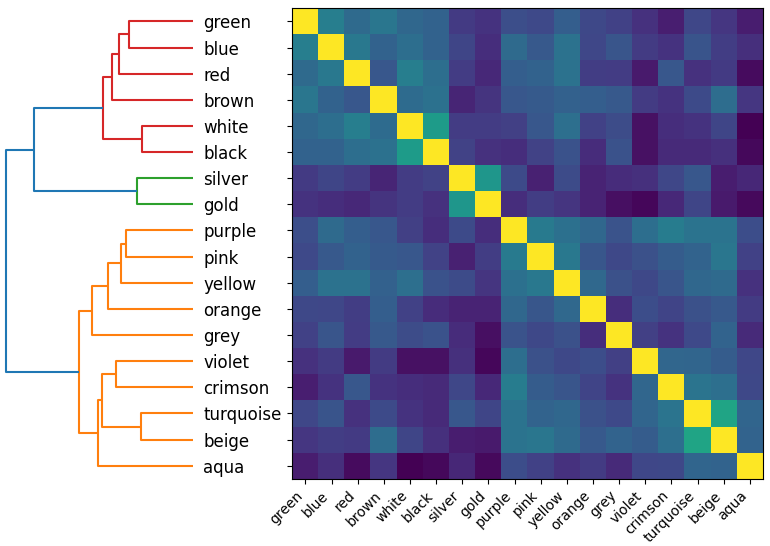

# BERT Embedding Math
This repository contains a number of experiments for investigating properties of the embeddings layer in BERT.
## Run
Later versions of Python will require you to run `export PYTHONPATH=$(pwd):$PYTHONPATH` before `python examples/folder/file.py`.  
To install requirements, `pip install -r requirements.txt`
## Results
### Location Modification
Sentence: **Rome** is the capital of [MASK].  
Modification: **Rome** = Rome - Italy + France  
Predicted label: France  
Confidence: 92.9% 

### City Embedding Clustering


### Colour Embedding Clustering

## Examples
Have a look in [examples/](examples/) for examples. The code is commented to explain what each file does how.  
### Maths
The embedding maths has a very simple parser that does not obey traditional operator precedence.  
An equation is a set of words/numbers interleaved with operators (so the leading + is necessary). Operators are done left to right and then added to the rightmost embedding:
```
He := + She - He / 2
```
translates to `He <- (((She) - He) / 2) + He`
